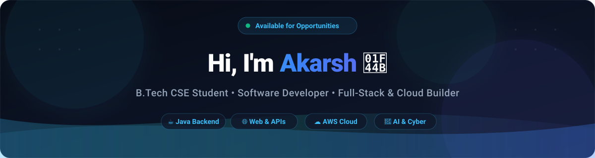

<div align="center">

  <!-- Native SVG Header Banner -->
  <a href="https://akarsh32-hub.github.io/portfolio/">
    
  </a>

  <br/><br/>

  <!-- Dynamic Typing Subtitle -->
  <a href="https://akarsh32-hub.github.io/portfolio/">
    
  </a>

  <br/><br/>

  <!-- Social & Quick Action Badges -->
  <p align="center">
    <a href="https://akarsh32-hub.github.io/portfolio/">
      
    </a>
    <a href="https://linkedin.com/in/singhakarsh01/">
      
    </a>
    <a href="mailto:askarsh32@gmail.com">
      
    </a>
    <a href="https://github.com/akarsh32-hub?tab=repositories">
      
    </a>
  </p>

</div>

---

### 👨‍💻 About Me

```yaml
name: Akarsh
current_status: B.Tech CSE (2024 - 2028)
institution: Axis Institute of Technology and Management, Kanpur
focus_areas:
  - Java & Data Structures & Algorithms
  - Full-Stack Web Development & APIs
  - Cloud Foundations (AWS) & Generative AI
  - Cybersecurity Fundamentals
learning_goal: Becoming a high-impact Software Development Engineer
fun_fact: "I turn coffee ☕ into clean code & interactive web apps!"
```

- 🔭 **Currently Building:** [SkyCast AI](https://akarsh32-hub.github.io/SkyCast-AI/) — District Disaster & Meteorological Intelligence Platform
- 🎵 **Featured Project:** [Mehfil](https://mehfildilse.netlify.app/) — Aesthetic music streaming web application
- 💻 **Engineering Focus:** Full-Stack Java Development (Spring Boot, Hibernate, REST APIs) & Cloud-Native Architectures
- 📜 **Certified In:** AWS Cloud Foundations, Google AI Fundamentals, Cisco Cybersecurity, MongoDB Atlas & Java Full Stack

---

### 🛠️ Tech Stack & Tooling

<div align="center">

#### 💻 Programming Languages
<p>
  
  
  
  
  
  
</p>

#### 🌐 Frontend & Web Technologies
<p>
  
  
  
  
</p>

#### ⚙️ Backend, Databases & Cloud
<p>
  
  
  
  
  
</p>

#### 🧰 Developer Tools & Platforms
<p>
  
  
  
  
  
</p>

</div>

---

### 🚀 Featured Deployments & Projects

| Project | Tech Stack | Description | Live Links |
| :--- | :--- | :--- | :---: |
| ⚡ **SkyCast AI** | `AI Platform`, `JavaScript`, `Weather API`, `GIS` | District Disaster & Meteorological Intelligence with Kisan AI & WhatsApp Alerts | [🌐 Live Demo](https://akarsh32-hub.github.io/SkyCast-AI/) • [📂 Code](https://github.com/akarsh32-hub/SkyCast-AI) |
| 🎵 **Mehfil** | `HTML5`, `CSS3`, `JavaScript`, `Audio API` | Aesthetic curated music streaming web application with responsive player | [🌐 Live Demo](https://mehfildilse.netlify.app/) • [📂 Code](https://github.com/akarsh32-hub/Mahfil-song-site) |
| 🌐 **Developer Portfolio v2** | `HTML5`, `Vanilla CSS`, `Bento UI`, `CLI Emulator` | Modern glassmorphic portfolio with interactive terminal & Command Palette | [🌐 Live Demo](https://akarsh32-hub.github.io/portfolio/) • [📂 Code](https://github.com/akarsh32-hub/portfolio) |


### 📬 Connect With Me

<p align="center">
  <a href="https://linkedin.com/in/singhakarsh01/">
    
  </a>
  &nbsp;
  <a href="mailto:askarsh32@gmail.com">
    
  </a>
  &nbsp;
  <a href="https://akarsh32-hub.github.io/portfolio/">
    
  </a>
</p>

<div align="center">
  
</div>
